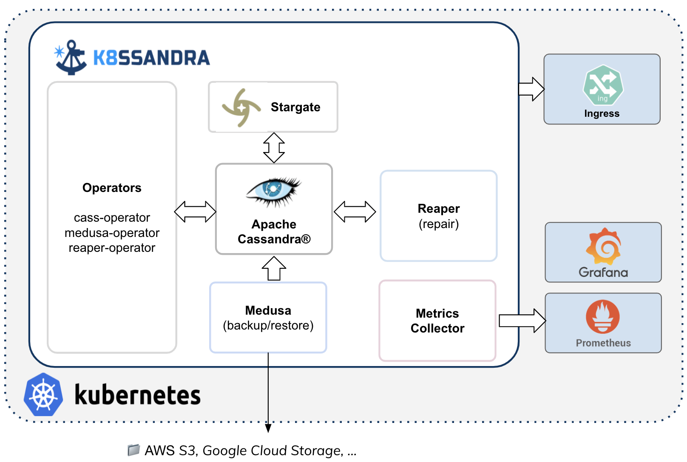

If you're new to K8ssandra, this FAQ is for you! Whether you're viewing this page in [GitHub](https://github.com/k8ssandra/k8ssandra/blob/main/docs/content/en/docs/faqs/_index.md) or on the [Web](https://k8ssandra.io/docs/faqs/), you can also propose new or modified FAQs. For this open-source project, contributions are welcome from the community of K8ssandra users. 

### What is K8ssandra?

K8ssandra is an open-source project that anyone in the community can use, improve, and enjoy. K8ssandra is a cloud native distribution of Apache Cassandra&reg; that runs on Kubernetes. Accompanying Cassandra is a suite of tools to ease and automate operational tasks. This includes metrics, data anti-entropy services, and backup/restore tools. As part of K8ssandra’s installation process, all of these components are installed and wired together, freeing your teams from having to perform the tedious plumbing of components.

### Ok - how do you pronounce "K8ssandra"?

Any way you want. But think of it this way:  "Kate" + "Sandra".

### What does K8ssandra include?

At a pure component level, K8ssandra integrates an packages together:

* Apache Cassandra
* Kubernetes Operator for Apache Cassandra (cass-operator)
* Cassandra Reaper, also known as the Repair Web Interface
* Cassandra Medusa for backup and restore
* Metrics Collector, which Prometheus integration and visualization via preconfigured Grafana dashboards
* Templates for connections into your Kubernetes environment via Ingress solutions such as Traefik

An illustration always helps:



In addition to the set of components, it's important to emphasize that K8ssandra is really a collection of experience from the community of Cassandra + Kubernetes users, packaged and ready for everyone to use freely. 

### How do I get started and install K8ssandra?

It's easy! There are several options, but we recommend using [Helm](https://helm.sh/docs/intro/install/) commands. If you haven't already, use git to clone this repo to your local environment. Starting from https://github.com/k8ssandra/k8ssandra, notice the Code button. Copy the desired protocol - such as `git@github.com:k8ssandra/k8ssandra.git` for SSH.  Then on your machine, enter:

`git clone git@github.com:k8ssandra/k8ssandra.git`

To get started, `cd` to the downloaded `k8ssandra` directory, and enter:

```
helm repo add k8ssandra https://helm.k8ssandra.io/
helm repo add traefik https://helm.traefik.io/traefik
helm repo update
helm install k8ssandra-tools k8ssandra/k8ssandra
helm install k8ssandra-cluster-a k8ssandra/k8ssandra-cluster  
```

For more, see [Getting Started](/docs/getting-started).


### What is cass-operator?

Kubernetes Operator for Apache Cassandra -- [cass-operator](https://github.com/datastax/cass-operator) -- is the most critical element bridging Kubernetes and Cassandra. The community has been focusing much of its attention on operators over the past two years, as the appropriate starting place. If there is magic happening, it’s all in the operator. The cass-operator serves as the translation layer between the control plane of Kubernetes and actual operation done by the Cassandra cluster. Recently, the Apache Cassandra project agreed on gathering around a single operator: cass-operator. Some great contributions from Orange with CassKop will be merged with the DataStax operator and a final version will be merged into the Apache project. This is the best example of actual production knowledge finding its way into code. Community members contributing to cass-operator are running large amounts of Cassandra in Kubernetes every day. 

### What is Reaper?

Cassandra Reaper is a tool that helps manage the critical maintenance task of anti-entropy **repair** in a Cassandra cluster. We also refer to Reaper as the [Repair Web Interface](/docs/topics/accessing-services/repair/). Originally created by Spotify, later adopted and maintained by The Last Pickle, Cassandra Reaper is now a sub-project of Apache Cassandra. If you were to sit a group of Cassandra DBAs down to talk about what they do, chances are they would talk a lot about running repairs. It’s an important operation because it keeps data consistent despite inevitable issues that happen like node failures and network partitions. In K8ssandra, Reaper runs it for you automatically! And because this is built for SREs, you can expect a good set of pre-built metrics to verify everything is working great. 

### What is Medusa?

Cassandra Medusa is also a sub-project of Apache Cassandra via Spotify and The Last Pickle. Backing up a distributed system takes a different approach than most DBAs have done. Medusa not only helps coordinate those tasks, but it manages the placement of the data at rest. The initial implementation allows backup sets to be stored and retrieved on cloud object storage (such as AWS S3 buckets) with more options on the way. K8ssandra offers this [backup and restore](/docs/topics/restore-a-backup/) feature to ensure you can recover data when issues occur.

### How can I access my Kubernetes resources from outside the environment?


### What kind of provisioning tasks can I perform with K8ssandra?

Among the tasks are dynamically scaling up or down the size of your cluster. See [Provisioning a cluster](/docs/topics/provision-a-cluster/).  

### More FAQs coming!

...

## Next

Read the documentation [topics](/docs/topics) and actively participate in the [community](https://k8ssandra.io/community/) of K8ssandra users.
