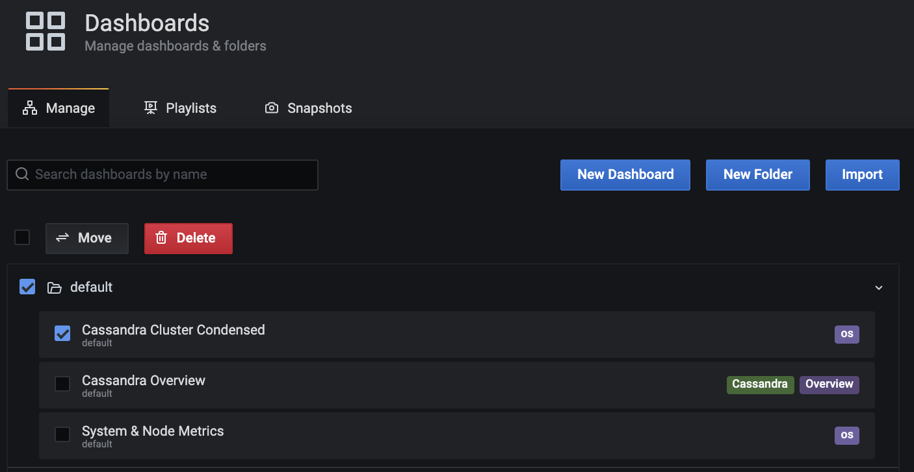

With the prerequisites that are identified below satisfied, you can access the preconfigured Grafana dashboard for K8ssandra. Example:

http://grafana.localhost:8080/

## Tools

* Web Browser

## Prerequisites

1. Kubernetes cluster with the following elements deployed:
   * [K8ssandra Operators]()
   * [K8ssandra Cluster]()
   * [Ingress Controller]()
1. DNS name for the Grafana service, referred to as _GRAFANA DOMAIN_ below.
1. DNS name for the Prometheus service, referred to as _PROMETHEUS DOMAIN_
   below.

## Access Grafana Interface

Check that the pods configured by K8ssandra are running:

`kubectl get pods`
```
NAME                                                              READY   STATUS      RESTARTS   AGE
cass-operator-65956c4f6d-f25nl                                    1/1     Running     0          4h26m
grafana-deployment-8467d8bc9d-czsg5                               1/1     Running     0          4h13m
k8ssandra-cluster-a-grafana-operator-k8ssandra-5bcb746b8d-4nlhz   1/1     Running     0          4h22m
k8ssandra-cluster-a-reaper-k8ssandra-6cf5b87b8f-vxrwj             1/1     Running     0          4h5m
k8ssandra-cluster-a-reaper-k8ssandra-schema-pjmv8                 0/1     Completed   5          4h8m
k8ssandra-cluster-a-reaper-operator-k8ssandra-55dc486998-f4r46    1/1     Running     0          4h22m
k8ssandra-dc1-default-sts-0                                       2/2     Running     0          4h22m
k8ssandra-tools-kube-prome-operator-6d57f758dd-7zd92              1/1     Running     0          4h26m
prometheus-k8ssandra-cluster-a-prometheus-k8ssandra-0             2/2     Running     1          4h22m
```

Notice that the Grafana Operator is running, as well as other services.

For example, if you are running a local Kubernetes environment, you can access the Grafana dashboard with a URL such as:

http://grafana.localhost:8080/

From the Grafana start page, click the Dashboards icon, and select the Manage pane:


Grafana loads its dashboard options:

1. Enable the Default checkbox.
1. Click the checkbox for one of the dashboards that K8ssandra created when you installed the `k8ssandra-cluster` instance
1. To open the selected dashboard, click on its text link. In this example, you'd click on Cassandra Cluster Condensed:



Here's an example of the Cassandra Cluster Condensed dashboard in Grafana:


### What can I do in Grafana?

* Cluster health
* Traffic metrics

## Access Prometheus Interface


Prometheus is available at the following address:

**http://PROMETHEUS_DOMAIN/**

For example:

http://prometheus.localhost:8080/

### What can I do in Prometheus?

* Validate serves being scraped
* Confirm metrics collection

## Next

Access the [Repair Web interface]({{ ref "repair" }}).
