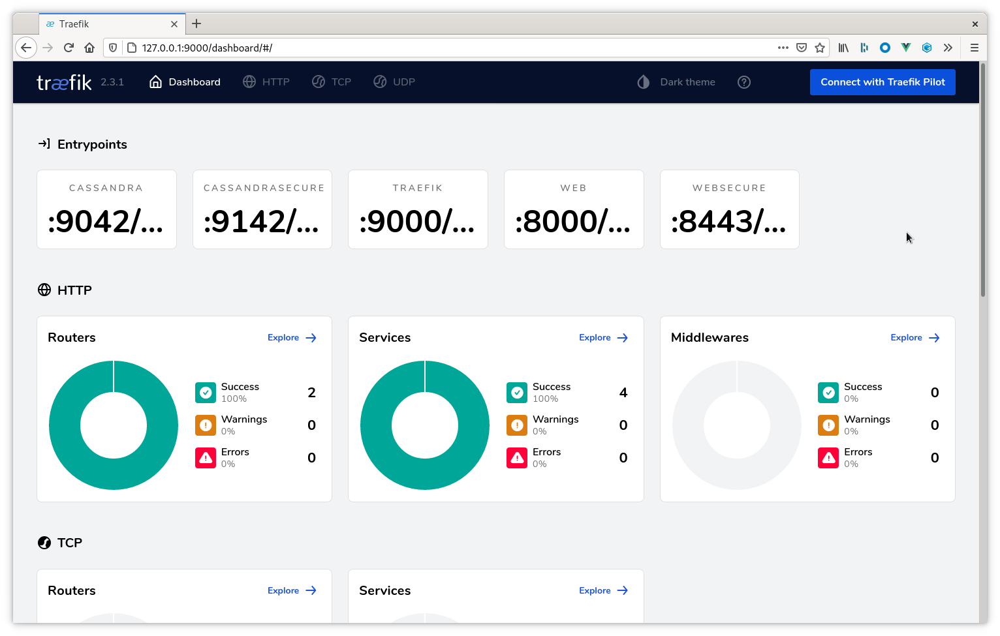

When configuring Kind to use Traefik additional configuration options are
required. The following guide walks through standing up a Kind k8s cluster with
Traefik configured for ingress on ports other than the standard `80` and `443`.

## 1. Create a Kind configuration file
Kind supports an optional configuration file for configuring specific behaviors
of the Docker container which runs the Kubelet process. Here we are adding port
forwarding rules for the following ports:

* `8080` - HTTP traffic - This is used for accessing the metrics and repair user
  interfaces
* `8443` - HTTPS traffic - Useful when accessing the metrics and repair
  interfaces in a secure manner
* `9000` - Traefik dashboard - **WARNING** this should only be done in
  development environments. Higher level environments should use `kubectl
  port-forward`.
* `9042` - C* traffic - Insecure Cassandra traffic. _Note:_ Without TLS (more
  specifically SNI) Traefik may **not** be able to distinguish traffic across
  cluster boundaries. If you are in an environment where more than one cluster
  is deployed you **must** add additional ports here.
* `9142` - C* TLS traffic - Secure Cassandra traffic, multiple clusters may run
  behind this single port.
  
### [`kind.config.yaml`](kind.config.yaml)

The `kind.config.yaml` file referenced here is located in:
  
  https://github.com/k8ssandra/k8ssandra/tree/main/docs/content/en/docs/topics/accessing-services/traefik/configuring-kind/kind.config.yaml

```yaml
kind: Cluster
apiVersion: kind.x-k8s.io/v1alpha4
nodes:
- role: control-plane
  kubeadmConfigPatches:
  - |
    kind: InitConfiguration
    nodeRegistration:
      kubeletExtraArgs:
        node-labels: "ingress-ready=true"
  extraPortMappings:
  - containerPort: 32080
    hostPort: 8080
    protocol: TCP
  - containerPort: 32443
    hostPort: 8443
    protocol: TCP
  - containerPort: 32090
    hostPort: 9000
    protocol: TCP
  - containerPort: 32091
    hostPort: 9042
    protocol: TCP
  - containerPort: 32092
    hostPort: 9142
    protocol: TCP
```

## 2. Start Kind Cluster

```bash
$ kind create cluster --config ./kind.config.yaml
Creating cluster "kind" ...
 ✓ Ensuring node image (kindest/node:v1.18.2) 🖼
 ✓ Preparing nodes 📦  
 ✓ Writing configuration 📜 
 ✓ Starting control-plane 🕹️ 
 ✓ Installing CNI 🔌 
 ✓ Installing StorageClass 💾 
Set kubectl context to "kind-kind"
You can now use your cluster with:

kubectl cluster-info --context kind-kind

Have a question, bug, or feature request? Let us know! https://kind.sigs.k8s.io/#community 🙂
```

## 3. Create Traefik Helm values file

Note the service type of `NodePort`. It is used here as it is the port _on the
Docker container running Kind_ which is forwarded to our local machine.

The `traefik.values.yaml` file referenced here is located in:

https://github.com/k8ssandra/k8ssandra/tree/main/docs/content/en/docs/topics/accessing-services/traefik/configuring-kind/traefik.values.yaml

### [`traefik.values.yaml`](traefik.values.yaml)
```yaml
providers:
  kubernetesCRD:
    namespaces:
      - default
      - traefik
  kubernetesIngress:
    namespaces:
      - default
      - traefik

ports:
  traefik:
    expose: true
    nodePort: 32090
  web:
    nodePort: 32080
  websecure:
    nodePort: 32443
  cassandra:
    port: 9042
    nodePort: 32091
  cassandrasecure:
    port: 9142
    nodePort: 32092

service:
  type: NodePort
```

## 4. Install Traefik via Helm

```bash
$ helm repo add traefik https://helm.traefik.io/traefik
$ helm repo update
$ helm install traefik traefik/traefik --create-namespace -f traefik.values.yaml
NAME: traefik
LAST DEPLOYED: Thu Nov 12 16:59:40 2020
NAMESPACE: default
STATUS: deployed
REVISION: 1
TEST SUITE: None
```

## 5. Access Traefik Dashboard

With the deployment complete we may now access the Traefik dashboard at [http://127.0.0.1:9000/dashboard/](http://127.0.0.1:9000/dashboard/). Example:



Feel free to explore the other [Traefik]() topics now that you have a local environment configured.
