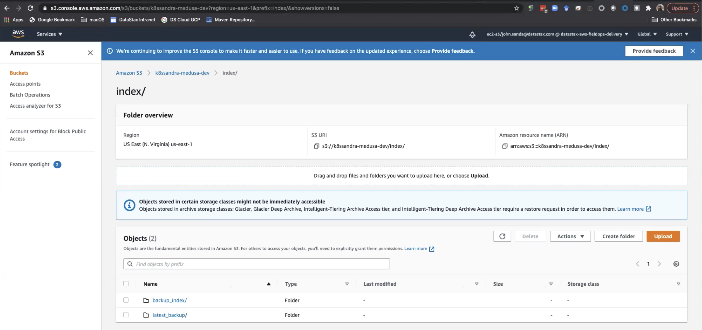
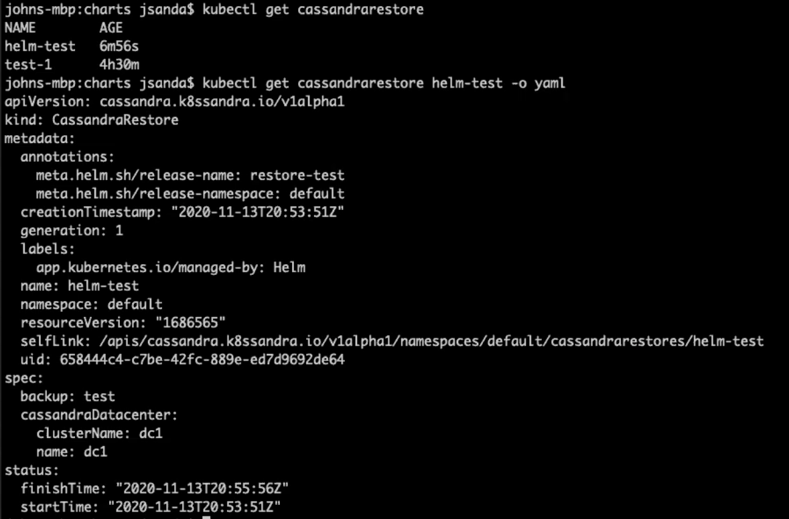

This topic walks you through the steps to backup and restore Cassandra data running in a Kubernetes cluster.

## Tools

* K8ssandra-tools Helm chart
* K8ssandra-cluster Helm chart, which we'll extend with `backupRestore` Medusa buckets for Amazon S3 integration
* Sample files in GitHub:
  * `medusa-bucket-key.yaml` to create a secret with credentials for an S3 bucket
  * `test_data.cql` to populate a Cassandra keyspace and table with data

## Prerequisites

* A Kubernetes environment
* [Helm](https://helm.sh/), a packaging manager for Kubernetes

All other prerequisites are handled by the installed tools listed above. The sample files are checked into GitHub.

## Steps

### Verify you've met the prereqs

If you haven’t already, install the k8ssandra chart.

`helm install k8ssandra-tools k8ssandra/k8ssandra`

Check the pod status:

```
kubectl get pods                              
NAME                                                         READY   STATUS    RESTARTS   AGE
cass-operator-86d4dc45cd-8p7cq                               1/1     Running   0          98s
k8ssandra-tools-kube-prome-operator-6bcdf668d4-b2r6v         1/1     Running   0          98s

```

The first `kubectl` command above installed the cass-operator and the Prometheus operator.

### Create secret for read/write access to an S3 bucket

Before creating the k8ssandra-cluster, we need to supply credentials so that Apache Medusa has read/write to an S3 bucket, which is where the backup will be stored.  Currently, Medusa supports local, Amazon S3, GKE, and other bucket types. In this example, we’re using S3.

To do this, start by creating a secret with the credentials for the S3 bucket.

The `medusa-bucket-key.yaml` sample in GitHub contains:

```
apiVersion: v1
kind: Secret
metadata:
 name: medusa-bucket-key
type: Opaque
stringData:
 # Note that this currently has to be set to medusa_s3_credentials!
 medusa_s3_credentials: |-
   [default]
   aws_access_key_id = my_access_key
   aws_secret_access_key = my_secret_key
```
   
In the YAML, notice the `stringData` property valuye: `medusa_s3_credentials`.  The secret gets mounted to this location; this is where Medusa expects to get the AWS credentials.

Apply the YAML to your Kubernetes environment:

```
kubectl apply -f medusa-bucket-key.yaml
secret/medusa-bucket-key configured
```

### Create or update the k8ssandra-cluster

Install the k8ssandra-cluster chart with the following properties. Backup and restore operations are enabled by default. In the following example, `bucketName` corresponds to the name of the S3 bucket: `K8ssanda-bucket-dev`.  The `bucketSecret` corresponds to the secret credentials.

```
helm install k8ssandra-cluster-1 k8ssandra/k8ssandra-cluster --set backupRestore.medusa.bucketName=k8ssanda-bucket-dev --set backupRestore.medusa.bucketSecret=medusa-bucket-secret`

The `k8ssandra-cluster` Helm chart includes cluster services and the Grafana Operator. Notice that `k8ssandra-cluster` add a number of properties in the `cassdc` datacenter.  

`kubectl get cassdc dc1 -o yaml`

In the output, see the `podTemplateSpec` property; two containers were added for Medusa.  Here’s the entry for the GRPC backup service:

`    name: medusa`

Here’s the entry for the restore’s init container. K8ssandra looks for an environment variable to be set, which would indicate when to perform a restore operation.

`    name: medusa-restore`

After a few minutes, once the pods have started, check the status:

`kubectl get cassdc dc1 -o yaml`
```
.
.
.
status:
  cassandrOperatorProgress: Ready
```
### Add test data

Now let’s create some test data.  The `test_data.cql` file in GitHub contains:

```
CREATE KEYSPACE medusa_test WITH replication = {'class': 'SimpleStrategy', 'replication_factor': 1};
USE medusa_test;
CREATE TABLE users (email text primary key, name text, state text);
insert into users (email, name, state) values ('john@gamil.com', 'John Smith', 'NC');
insert into users (email, name, state) values ('joe@gamil.com', 'Joe Jones', 'VA');
insert into users (email, name, state) values ('sue@help.com', 'Sue Sas', 'CA');
insert into users (email, name, state) values ('tom@yes.com', 'Tom and Jerry', 'NV');
```

Copy the cql file to the Kubernetes container (pod) :

`kubectl cp test_data.cql cassandra-dc1-default-sts-0:/tmp -c cassandra`

Add this data to the Kubernetes-hosted Cassandra database:

`kubectl exec -it cassandra-dc1-default-sts-0 -c cassandra -- cqlsh -f /tmp/test_data.cql`

Exec open cqlsh:

`kubectl exec -it cassandra-dc1-default-sts-0 -c cassandra -- cqlsh`

```
Connected to k8ssandra at 127.0.0.1:9042.
[cqlsh 5.0.1 | Cassandra 3.11.7 | CQL spec 3.4.4 | Native protocol v4]
Use HELP for help.
cqlsh> use medusa_test;
cqlsh:medusa_test> select * from medusa_test.users;

 email          | name          | state
----------------+---------------+-------
 john@gamil.com |    John Smith |    NC
  joe@gamil.com |     Joe Jones |    VA
   sue@help.com |       Sue Sas |    CA
    tom@yes.com | Tom and Jerry |    NV

(4 rows)
```

Exit out of CQLSH:

`cqlsh:medusa_test> exit`

Review the current charts that are in use, so far:

`helm list`

```
NAME               	NAMESPACE	REVISION	UPDATED                             	STATUS  	CHART                  	APP VERSION
k8ssandra-cluster-1	default  	1       	2020-11-16 11:34:23.240881 -0700 MST	deployed	k8ssandra-cluster-0.3.0	3.11.7     
k8ssandra-tools    	default  	1       	2020-11-16 10:27:36.947788 -0700 MST	deployed	k8ssandra-0.3.0        	3.11.7  
```

Also get the deployment status, so far:

`kubectl get deployment`


The output above shows the addition of medusa-test-medusa-operator-k8ssandra pod. 

### Create the backup

Now create a backup using a `test` chart:

`helm install test ./backup --set name=test,cassandraDatacenter.name=dc1`

```
kubectl get cassandrabackup
NAME       AGE
test       17s
```

Examine the YAML:

`kubectl get cassandrabackup test -o yaml`

The Status section in the YAML shows the backup operation’s start and finish timestamps.

### Amazon S3 buckets

Let's look at the resources in the Amazon S3 dashboard. 

S3 maintains the `backup_index` bucket so it only has to store a single copy of an SSTable across backups.  S3 stores pointers in the index to the SSTables. That implementation avoids a large amount of storage.  For example: 



### Restore data from the backup

<!--- this restore in place assumes the Nov 15 implementation --> 

Consider the case where an unexpected event occurred, such as an authorized user accidentally entering cqlsh `TRUNCATE` commands that wiped out data in Cassandra. You can restore data from the backup. For example:

`helm install restore-test ./restore --set name=helm-test,backup.name=test,cassandraDatacenter.name=dc1`

Examine the YAML:

`kubectl get cassandrarestore helm-test -o yaml`

The output shows the restore operation’s start time and that the `cassandraDatacenter` is being recreated.

You can also examine the in-progress logs:

`kubectl logs cassandra-dc1-default-sts-0 -c medusa-restore`

To view the result of the restore in cqlsh:

`kubectl get pods`

Look for the running pod, `k8ssandra-grafana-operator-k8ssandra-<pod-id>`. In this example:


Then enter, for example:

`kubectl exec -it k8ssandra-grafana-operator-k8ssandra-7c887cbb6-rds7w`

### Launch cqlsh again and verify the restore

Exec into cqlsh and select the data again, to verify the restore operation.

```
kubectl exec -it k8ssandra-dc1-default-stc-0 -c cassandra -cqlsh

Connected to k8ssandra at 127.0.0.1:9042.
[cqlsh 5.0.1 | Cassandra 3.11.7 | CQL spec 3.4.4 | Native protocol v4]
Use HELP for help.
cqlsh> use medusa_test;
cqlsh:medusa_test> select * from medusa_test.users;

 email          | name          | state
----------------+---------------+-------
 john@gamil.com |    John Smith |    NC
  joe@gamil.com |     Joe Jones |    VA
   sue@help.com |       Sue Sas |    CA
    tom@yes.com | Tom and Jerry |    NV

(4 rows)
```

You can look again at the cassandrarestore helm-test YAML for the start and ending timestamps:

`kubectl get cassadrarestore helm-test -o yaml`



## Next

Learn how to use the Repair Web Interface (Reaper).
